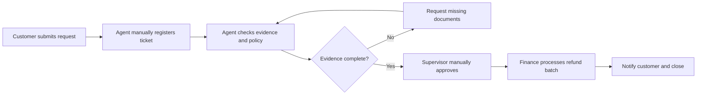

# AS-IS — current hypothetical workflow

```mermaid
flowchart LR
 A[Customer submits request] --> B[Agent manually registers ticket]
 B --> C[Agent checks evidence and policy]
 C --> D{Evidence complete?}
 D -- No --> E[Request missing documents]
 E --> C
 D -- Yes --> F[Supervisor manually approves]
 F --> G[Finance processes refund batch]
 G --> H[Notify customer and close]
```

**Bottlenecks (hypotheses):** repeated evidence checks, supervisor queue, batch refund processing.
