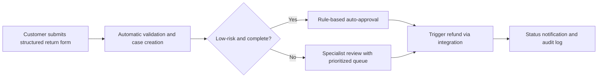

# TO-BE — proposed future workflow

```mermaid
flowchart LR
 A[Customer submits structured return form] --> B[Automatic validation and case creation]
 B --> C{Low-risk and complete?}
 C -- Yes --> D[Rule-based auto-approval]
 C -- No --> E[Specialist review with prioritized queue]
 D --> F[Trigger refund via integration]
 E --> F
 F --> G[Status notification and audit log]
```

**Control:** exception cases still require human judgment; auto-approval requires approved policy and safeguards.
